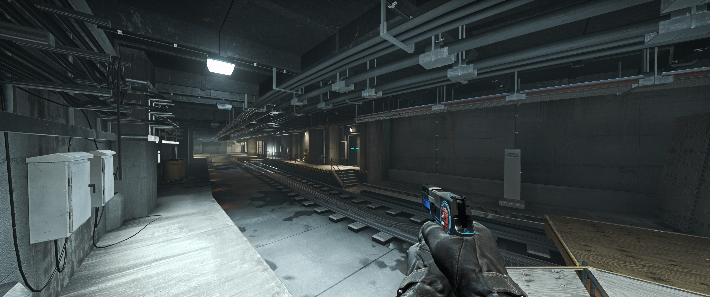

# kwaa/csgo

My CS:GO crosshair &amp; scripts.

## Crosshair

### [Static](crosshair_static.cfg)

- `CSGO-QZMoP-kuKRv-8PoiG-M6bKA-WkRqJ`

Classic static crosshair. performs well on WQHD (especially Ultrawide) monitors.

## Scripts

### [Special `Q`](special_q.cfg)

Hold the knife while holding <kbd>Q</kbd>, and return to the previous weapon when you release it

Suitable for AWP / SSG 08

### [Special `ALT`](special_alt.cfg)

Bind <kbd>Alt</kbd> to Auto Jump-Crouch.

### [Special `TAB`](special_tab.cfg)

Press <kbd>TAB</kbd> while viewing network graph.
